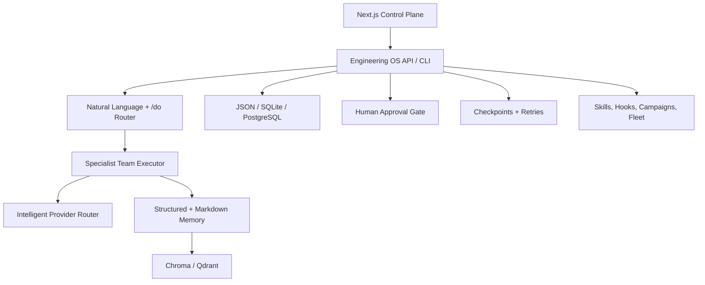

# ForgeOS

> The AI Engineering Operating System.

ForgeOS is the product control plane built additively on Citadel. It lives in
`packages/engineering-os/`. The existing skills, hooks, `/do` router, campaigns,
fleet sessions, Markdown memory, and `.planning/` state remain canonical and
fully supported.

## Capability Map

| Capability | Implementation |
|---|---|
| Natural language tasks | `NaturalLanguageRouter`; `/do` remains supported |
| Automatic teams | `AgentFactory` + bounded `ParallelAgentExecutor` |
| Multi-LLM routing | OpenAI, Anthropic, Gemini, DeepSeek, and xAI adapters |
| Durable state | `TaskStore` interface with JSON and SQL implementations |
| Memory | Structured records with Markdown compatibility |
| Vector search | Chroma and Qdrant adapters with injectable embeddings |
| Knowledge base | PDF, Markdown, GitHub, Notion, and Confluence loader contracts |
| Safety | File-backed approvals for destructive and deployment actions |
| Recovery | Atomic checkpoints and exponential-backoff retries |
| Delivery | GitHub, GitHub Actions, Docker, AWS, Azure, and Vercel contracts |
| Self-learning | Accepted fixes and user feedback stored as reusable memory |
| Diagrams | Mermaid architecture, dependency, and API flow generators |
| Dashboard | Next.js + Tailwind app in `control-plane/` |

## Commands

```bash
npm install
npm run os:check
npm run os:plan -- "audit this API and add regression tests"
npm run console:dev
```

Executing a task requires at least one provider key. Planning, routing, memory,
approval, diagram, and dashboard features work without an LLM key.

## Storage

The default zero-dependency adapters write under:

```text
.planning/
  engineering-os/tasks/
  engineering-os/events/
  approvals/
  checkpoints/
  memory/records/
```

Production deployments can inject a SQLite or PostgreSQL driver through
`SqlTaskStore`. SQL access is deliberately driver-neutral so deployments can use
their approved library, connection pool, migrations, and secret manager.

## Knowledge Connectors

`KnowledgeBase` accepts pluggable loaders. Markdown works locally.
PDF extraction is injected so deployments can choose a vetted parser. GitHub,
Notion, and Confluence use `HttpContentLoader` callbacks, keeping credentials
outside the core package. Chroma and Qdrant are optional vector backends.

## Compatibility Terminology

| Existing name | Preferred product term | Compatibility |
|---|---|---|
| harness | engineering operating system | Existing wording remains valid |
| dashboard | control plane | `/dashboard` remains unchanged |
| `.planning/` | workspace state | Path remains canonical |
| fleet | parallel team | `/fleet` remains unchanged |
| skill | capability | `skills/` remains unchanged |

No existing folders, commands, hooks, or state formats were renamed.

## Architecture


